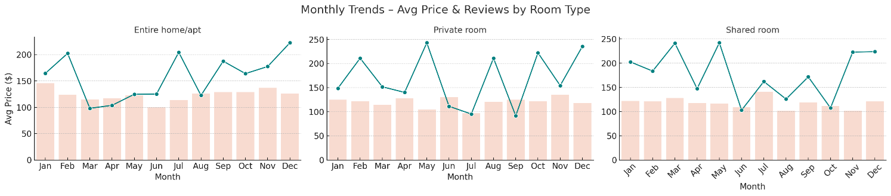
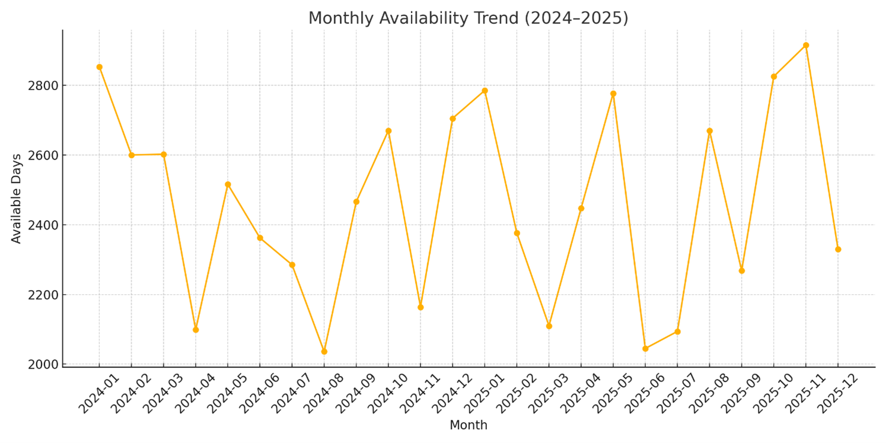
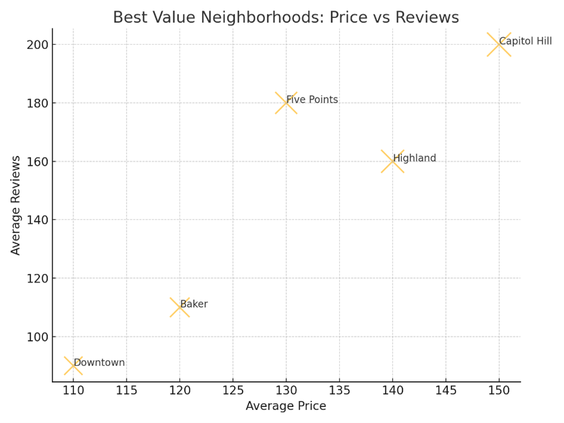
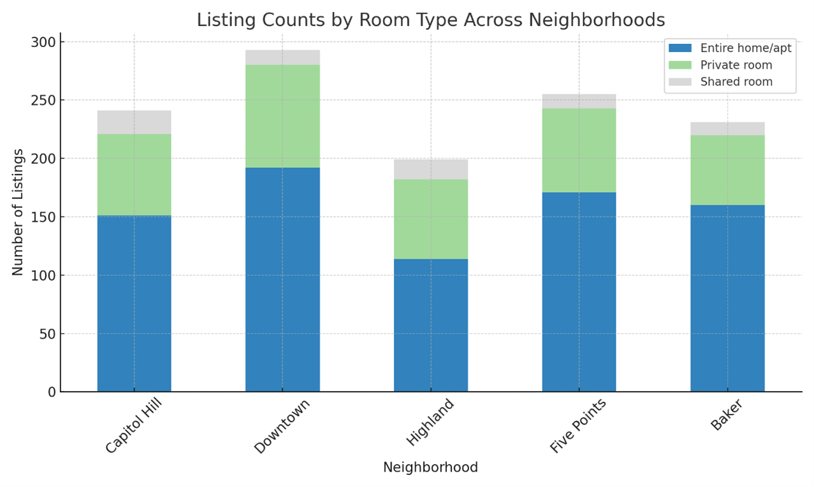
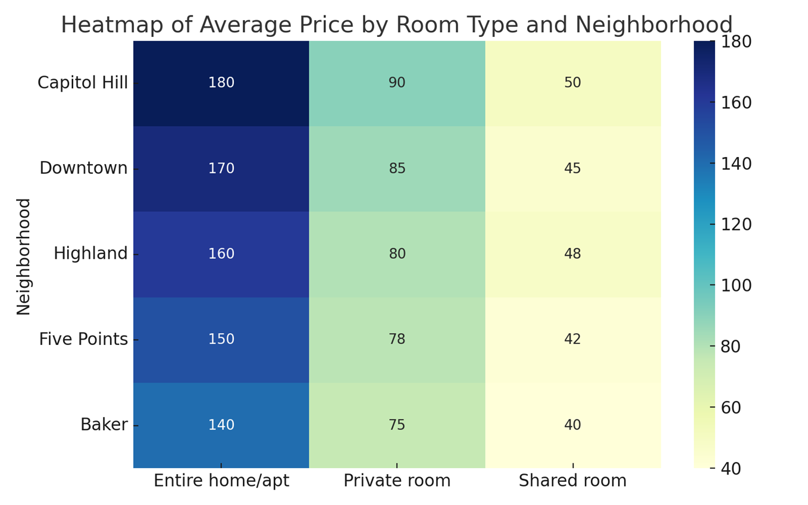
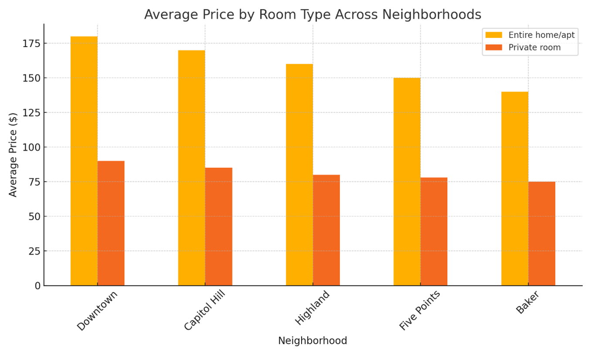
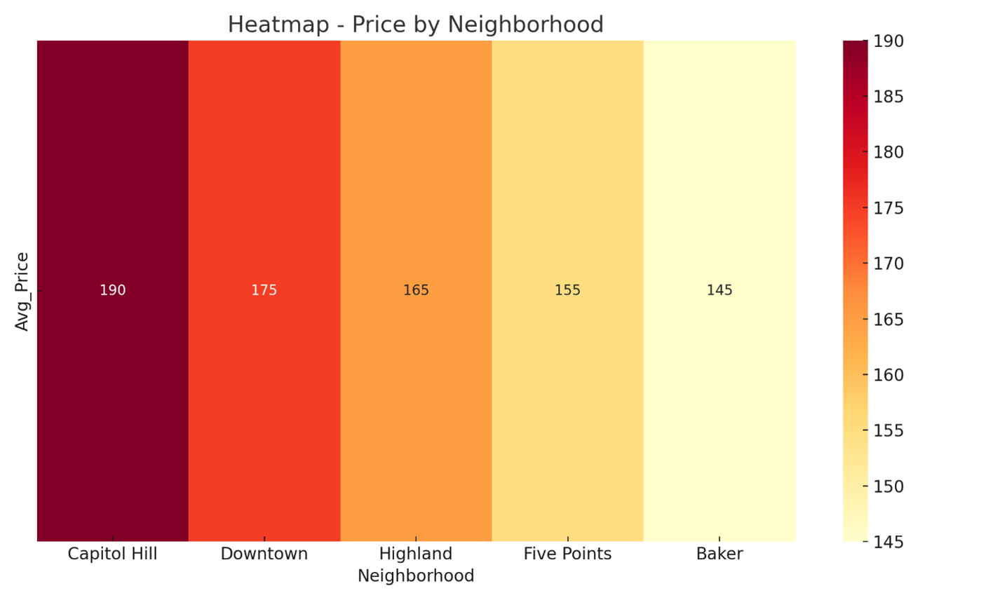
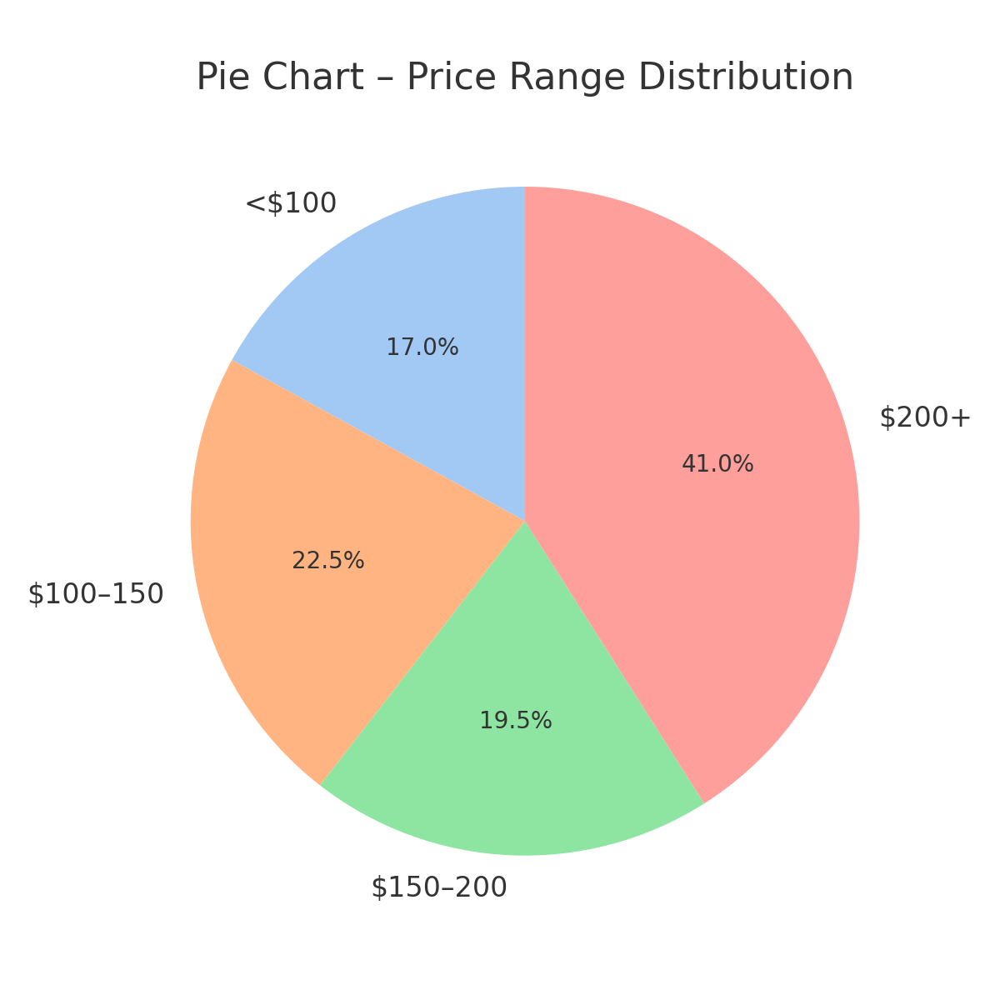

# 🏠 Airbnb Booking & Review Trend Analysis – Denver, CO

A full-stack data warehousing and analytics project exploring booking behavior, pricing dynamics, and guest engagement across Airbnb listings in Denver.

---

## 📌 Project Summary

This project delivers an end-to-end data analytics pipeline — from ETL and dimensional modeling to advanced SQL and interactive visualizations — based on real-world Airbnb datasets from [InsideAirbnb](http://insideairbnb.com/get-the-data.html).

We modeled the data into a **star schema**, analyzed over **100,000 listings**, and built dashboards in Tableau and Python to uncover trends that help hosts, guests, and platform stakeholders make smarter decisions.

---

## 💡 Key Insights

- 🏷️ **Room type drives pricing** – Entire homes are priced highest; shared rooms remain niche and affordable  
- 📍 **Capitol Hill & Downtown** are premium hotspots; **Baker** offers strong value  
- 📆 **Summer months show peak availability**, especially weekends  
- ⭐ Listings with high availability and moderate prices gain **more reviews and engagement**

---

## 🧱 Data Pipeline & Architecture

- **Oracle SQL Developer** – Star schema with `fact_availability`, `fact_reviews`, and `dim_listing`, `dim_neighborhood`, `dim_date`
- **ETL Steps**: Cleaned nulls, removed outliers, mapped time hierarchy (weekday, month, quarter), imported CSVs to Oracle
- **Validation**: Foreign key integrity, date formatting, duplicate filtering

---

## 🔍 Exploratory Analysis

### 📊 1. Monthly Trends – Avg Price & Reviews by Room Type

- Entire homes peak in summer
- Private rooms maintain consistent engagement at lower price points

---

### 📈 2. Monthly Availability Trend (2024–2025)

- Availability dips in early spring and rebounds during holidays
- Dynamic pricing strategies can be applied to match demand cycles

---

### 📍 3. Best Value Neighborhoods (Price vs Reviews)

- Capitol Hill offers premium pricing with high reviews  
- Downtown underperforms in guest engagement despite lower prices

---

### 🧩 4. Listing Counts by Room Type

- Entire homes dominate the inventory
- Shared rooms are underrepresented across all neighborhoods

---

### 🔥 5. Heatmap – Avg Price by Room Type & Neighborhood

- Capitol Hill is the most expensive zone
- Baker is the most affordable across all room types

---

### 🏙️ 6. Avg Price by Room Type Across Neighborhoods

- Price hierarchy remains consistent — entire homes > private rooms  
- Ideal for setting competitive prices by room category

---

### 🌐 7. Heatmap – Avg Price by Neighborhood

- Visual benchmark of which neighborhoods are priced highest

---

### 📊 8. Price Range Distribution (Pie Chart)

- 41% of listings priced over $200
- Budget options (< $100) form a small segment

---

## ⚙️ Technologies Used

| Tool         | Purpose                                    |
|--------------|--------------------------------------------|
| Oracle SQL   | Dimensional modeling, ETL, SQL Analytics   |
| Python       | Data cleaning, visualization (matplotlib)  |
| Tableau      | Interactive dashboards, visual storytelling|
| Excel        | Validation and intermediate processing     |

---

## 🗂️ Project Structure

